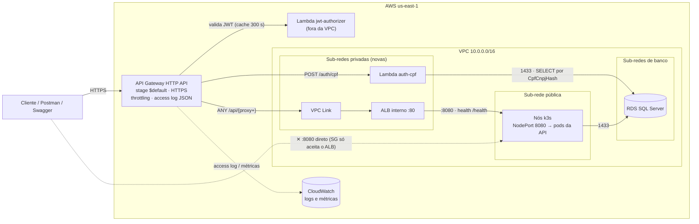
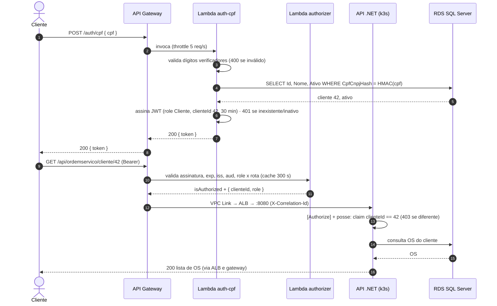
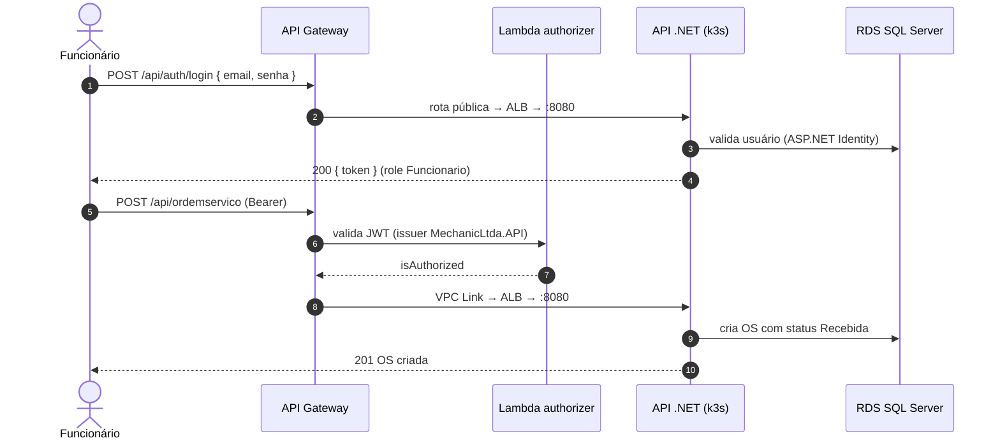

# Plano de desenvolvimento — API Gateway do MechanicLtda (Fase 3)

> Feature: **API Gateway + autenticação de clientes por CPF**
> Base analisada: `main@89b9a88` · Nuvem: AWS `us-east-1`
> Fontes: *13SOAT – Fase 3 – Tech Challenge*, aulas de API Gateway (1–6) e *Desenvolvimento Serverless – Aula 4*.

## Onde cada fase é implementada

A separação em quatro repositórios já aconteceu (`main` deste repositório não tem mais `infra/`
nem `k8s/`), então as fases se distribuem assim:

| Fase | Repositório | Situação |
|---|---|---|
| 0 · Decisões e contratos | **MechanicLtda** (`docs/rfc`, `docs/adr`) | RFC-001 e ADR-001 a 004 escritos |
| 1 · Backend privado (sub-redes, ALB, SGs) | [InfraKubernete](https://github.com/Fiap-Mecanic-Ltda/InfraKubernete) | implementada em `feature/api-gateway-cluster` |
| 2 · API Gateway (rotas da aplicação, VPC Link, throttling, access log) | [Lambda](https://github.com/Fiap-Mecanic-Ltda/Lambda) | implementada em `feature/auth-cpf-e-rotas-protegidas` |
| 3 · Autenticação por CPF e Lambda authorizer | [Lambda](https://github.com/Fiap-Mecanic-Ltda/Lambda) | implementada em `feature/auth-cpf-e-rotas-protegidas` |
| 4 · Ajustes na aplicação | **MechanicLtda** (este repositório) | implementada em `feature/auth-cpf-api-gateway` |
| 5 · Observabilidade (New Relic) | MechanicLtda, InfraKubernete e Lambda | implementada em `feature/observabilidade-new-relic` (aplicação) e `feature/observabilidade-e-cicd` (InfraKubernete e Lambda) |
| 6 · CI/CD (sem ambiente de homologação) | todos os repositórios | implementada em `feature/ci-cd-branches` (aplicação), `feature/observabilidade-e-cicd` (InfraKubernete e Lambda) e `feature/ci-cd-deploy-automatico` (InfraSGBD) |
| 7 · Documentação e vídeo | **MechanicLtda** | parcial (RFC/ADR prontos) |

**Decisões do time registradas na implementação das Fases 5 e 6:**

- **Sem ambiente de homologação na AWS.** As branches de homologação (e `desenvolvimento`, na
  aplicação) rodam build, testes e `plan`; só a `main` aplica e faz deploy, automaticamente. Todo
  apply roda no Environment `production`, onde revisores obrigatórios podem aprovar depois do
  `plan`.
- **New Relic** como ferramenta de observabilidade: agente APM .NET nas imagens, eventos de
  negócio (`OrdemServicoEvento`, `OrdemServicoFalha`, `FalhaIntegracao`), integração Kubernetes
  pelo HelmChart do k3s, e alertas, painel e monitor sintético como código em
  `InfraKubernete/observability`. O API Gateway e as Lambdas têm alarmes no CloudWatch, porque
  só aparecem no New Relic com a integração AWS da conta.

Duas correções em relação ao plano original, feitas na implementação:

- **O API Gateway vive no repositório da Lambda**, e não no InfraKubernete. Ele já existia lá
  (publicando `POST /auth/login`), então as rotas da aplicação, o VPC Link e o authorizer foram
  adicionados no mesmo HTTP API — uma URL só. O InfraKubernete provê o ALB interno, as
  sub-redes de aplicação e os outputs que a Lambda consome por `terraform_remote_state`.
- A Lambda que existia autenticava **e-mail e senha** contra as tabelas do Identity, o que não
  atende ao requisito da fase; a autenticação por CPF foi adicionada como segunda rota da mesma
  função, preservando a primeira.

A regra de entrada na porta 1433 para o security group da Lambda pertence ao repositório
**InfraSGBD** — na prática ela já é criada pelo próprio stack da Lambda, para não haver
dependência circular entre os stacks.

---

## 1. O que a Fase 3 pede e onde o plano atende

| Requisito do Tech Challenge | Onde é atendido |
|---|---|
| Implementar um API Gateway (AWS API Gateway, Kong, Traefik…) | Fases 1 e 2 |
| Proteger rotas sensíveis com autenticação via CPF | Fase 2 (authorizer), Fase 3, Fase 4.4 |
| Function serverless: validar CPF, consultar existência/status do cliente, gerar JWT | Fase 3 (+ Fase 4.1, índice do CPF) |
| API Gateway para controle e roteamento, provisionado com Terraform | Fases 1 e 2 |
| 4 repositórios com CI/CD e deploy automático de homologação e produção | Fase 3 (repo da Lambda) e Fase 6 |
| Monitorar latência das APIs, logs JSON com correlação, alertas | Fase 5 e Fase 4.7 |
| Diagrama de componentes, diagrama de sequência, RFCs e ADRs | Fases 0 e 7 |
| Vídeo: autenticação com CPF e consumo das APIs protegidas | Fase 7 |

---

## 2. Ponto de partida (o que o código mostra hoje)

- **Infra (Terraform em `infra/`)**: VPC `10.0.0.0/16` com uma sub-rede pública e duas de banco; k3s numa EC2 `t3.small` com EIP (`infra/ec2.tf`) mais workers num ASG (`infra/asg.tf`); RDS SQL Server Express privado (`infra/rds.tf`); segredos no SSM em `/mechanicltda/prod/*` (`infra/ssm.tf`); state no S3.
- **Exposição**: API e Web saem direto pelo IP público, em **HTTP**, via NodePort `8080`/`8090` (`k8s/overlays/prod/kustomization.yaml`), com SG liberado para `0.0.0.0/0` (`infra/security_groups.tf`, `var.api_allowed_cidr`). Não há load balancer nem gateway.
- **Autenticação atual**: a própria API emite JWT HS256 em `POST /api/Auth/login` (e-mail/senha, ASP.NET Identity) — `src/MechanicLtda.Application/AppServices/AuthAppService.cs`. Issuer `MechanicLtda.API`, audience `MechanicLtda.Clients`, 60 min; chave em `JWT_SECRET_KEY` (SSM `jwt-secret-key`). Roles: `Administrador`, `Funcionario`, `Cliente` (`src/MechanicLtda.Bootstrap/Authorization/Roles.cs`).
- **CI/CD**: um único workflow (`.github/workflows/main.yml`) na branch `main`, com plan/apply do Terraform, build, testes, push no ECR e deploy via SSM Run Command. Só existe o ambiente `prod`.

### Achados que mudam o plano

1. **O CPF não é pesquisável no banco.** `CpfCnpjEncryptionConverter` cifra o CPF com AES e **IV aleatório** — o mesmo CPF gera um texto cifrado diferente a cada gravação. A Lambda não consegue fazer `WHERE CpfCnpj = @cpf`. Solução: coluna de **índice cego** `CpfCnpjHash` (HMAC-SHA256 do CPF normalizado) — Fase 4.1.
2. **Os CPFs do seed são inválidos.** `DataSeederExtension.cs:53-55` usa `123.456.789-01`, `234.567.890-12` e `345.678.901-23`, que falham no cálculo dos dígitos verificadores (o mesmo de `CpfCnpjAttribute`). A Lambda recusaria todos os clientes de demonstração — Fase 4.2.
3. **A posse do recurso não é verificada.** `GET /api/OrdemServico/cliente/{clienteId}` aceita a role `Cliente`, mas o controle "o cliente só consulta o próprio clienteId" existe apenas como comentário (`OrdemServicoController.cs:84-90`). Com tokens por CPF isso vira falha de segurança — Fase 4.4.
4. **O backend é acessível sem passar por nenhum controle.** Enquanto a `8080` estiver aberta à internet, qualquer gateway pode ser contornado. O backend precisa ficar privado (VPC Link + ALB interno) — Fase 1.
5. **O roteamento do API Gateway diferencia maiúsculas de minúsculas**; o ASP.NET não. As rotas hoje saem como `/api/OrdemServico/...` no Swagger — Fase 4.5.

---

## 3. Decisão: qual gateway (resumo do RFC-001)

| Critério | **AWS API Gateway — HTTP API** | AWS API Gateway — REST API | Kong OSS no k3s | Azure APIM |
|---|---|---|---|---|
| Operação | Gerenciado, serverless | Gerenciado | Pods no cluster `t3.small` (disputa CPU/RAM com API e Web) | Gerenciado, mas em outra nuvem |
| Integração com Lambda | Nativa (proxy + Lambda authorizer) | Nativa | Plugin `aws-lambda` | Azure Functions |
| Backend privado | VPC Link → ALB, NLB ou Cloud Map | VPC Link → só NLB | Nativo (Service ClusterIP) | — |
| Limite de taxa | Throttling por rota/stage | Usage plans + API keys por consumidor | `rate-limiting` por consumer | Políticas |
| Cache de resposta | Não | Sim (pago) | `proxy-cache` | Sim |
| WAF | Não | Sim | Não | — |
| HTTPS | Incluso | Incluso | Exige certificado/ingress | Incluso |
| Custo | ~US$ 1,00 / milhão de req. | ~US$ 3,50 / milhão de req. | Custo dos nós | Tier Developer ~US$ 50/mês |
| Aula de referência | Serverless Aula 4 | Serverless Aula 4 | API Gateway Aulas 4–6 | API Gateway Aulas 2–3 |

**Recomendação: AWS API Gateway (HTTP API) + VPC Link + ALB interno + Lambda authorizer.**
O projeto já está na AWS, o requisito de autenticação serverless pede Lambda, e o HTTP API integra as duas coisas sem rodar mais nada nos nós `t3.small`. É o desenho da aula de Serverless (API Gateway → VPC Link → ALB → tarefas), trocando o ECS Fargate pelos nós k3s. Abrimos mão de cache e de WAF: o volume é baixo, e o risco de força bruta é tratado com throttling na rota de login (ver Riscos).

**Se o time preferir Kong:** as Fases 1–2 viram "Kong DB-less no k3s" (config declarativa em ConfigMap, plugins `jwt`, `rate-limiting`, `correlation-id`, `prometheus` e `aws-lambda`), o ALB e o VPC Link deixam de existir e o Kong passa a ser o único NodePort exposto. As Fases 3–7 praticamente não mudam.

---

## 4. Arquitetura alvo



Pontos do desenho:

- **Stage `$default`**: em integrações privadas com stage nomeado, o nome do stage vai no path para o ALB; com `$default` o path chega intacto.
- **Duas camadas de autorização**: o gateway autentica (assinatura, `exp`, `iss`, `aud`) e barra rota incompatível com a role; a API continua validando o JWT, a role (`[Authorize(Roles)]`) e a **posse** do recurso.
- **Mesma chave, mesmo formato**: a Lambda assina com o mesmo `JWT_SECRET_KEY` e a mesma audience da API, então o `JwtBearer` atual aceita os tokens de CPF com uma única mudança (aceitar dois issuers).
- **Lambda sem NAT**: a VPC não tem NAT Gateway. A `auth-cpf` só fala com o RDS (mesma VPC) e recebe os segredos por variável de ambiente cifrada no deploy; o authorizer fica fora da VPC (sem I/O, cold start menor).

---

## 5. Rotas do gateway

| Rota no gateway | Integração | Autorização no gateway | Autorização na API | Throttling |
|---|---|---|---|---|
| `POST /auth/cpf` | Lambda `auth-cpf` | Pública | — | 5 req/s, burst 10 |
| `POST /api/auth/login` | ALB → API | Pública | `[AllowAnonymous]` | 5 req/s, burst 10 |
| `GET /api/aprovacaoordemservico/{token}/aprovar` e `/recusar` | ALB → API | Pública (token do e-mail) | `[AllowAnonymous]` | padrão |
| `GET /health` | ALB → API | Pública | anônima | padrão |
| `GET /swagger` e `GET /swagger/{proxy+}` | ALB → API | Pública | anônima | padrão |
| `GET /api/ordemservico/cliente/{clienteId}` | ALB → API | JWT (Cliente ou Admin) | `AdminOuCliente` + posse do `clienteId` | padrão |
| `ANY /api/{proxy+}` | ALB → API | JWT (Admin/Funcionário; Cliente é negado) | Roles atuais | padrão (50 req/s, burst 100) |

O HTTP API escolhe a rota mais específica, então as rotas públicas explícitas vencem o `ANY /api/{proxy+}`. O CORS é configurado no próprio gateway (o preflight `OPTIONS` não passa pelo authorizer).

---

## 6. Contrato do token e do endpoint `/auth/cpf`

**Requisição e respostas**

```http
POST /auth/cpf
Content-Type: application/json

{ "cpf": "529.982.247-25" }
```

| Status | Quando | Corpo |
|---|---|---|
| `200` | CPF válido, cliente existe e está ativo | `{ "token": "...", "expiracao": "2026-09-12T18:30:00Z", "cliente": { "id": 2, "nome": "Fernanda Lima" } }` |
| `400` | Dígitos verificadores inválidos | `{ "mensagem": "CPF invalido." }` |
| `401` | Cliente inexistente **ou** inativo (mensagem única, para não revelar qual) | `{ "mensagem": "Nao foi possivel autenticar com o CPF informado." }` |
| `429` | Throttling do gateway (5 req/s na rota) | resposta padrão do API Gateway |
| `503` | `CPF_HASH_KEY` ausente no ambiente | `{ "mensagem": "Autenticacao por CPF indisponivel." }` |

> Formato alinhado ao `POST /auth/login` que já existia no repositório da Lambda: mesmo envelope
> (`token` + `expiracao`) e mesmo campo de erro (`mensagem`).

**Claims do JWT emitido pela Lambda** (HS256, mesma chave da API)

| Claim | Valor |
|---|---|
| `iss` | `MechanicLtda.Auth.Cpf` (a API passa a aceitar este e `MechanicLtda.API`) |
| `aud` | `MechanicLtda.Clients` |
| `sub` / `clienteId` | Id do cliente (ex.: `2`) |
| `role` | `Cliente` |
| `tipo` | `Cliente` (mesmo claim que a API já emite) |
| `exp` | 30 minutos |
| `jti` | GUID |

O CPF **não** vai no token nem nos logs (LGPD).

**Lambda authorizer** (payload 2.0, respostas simples): identity sources `$request.header.Authorization` e `$context.routeKey`, cache de 300 s. Devolve `isAuthorized` e o contexto `{ sub, role, clienteId }`. A integração repassa `X-Correlation-Id: $context.requestId` e `X-Cliente-Id: $context.authorizer.clienteId` ao backend, apenas para log e correlação — a API continua decidindo pelo JWT.

---

## 7. Fluxos (rascunhos dos diagramas de sequência exigidos)

### 7.1 Autenticação por CPF e consumo de rota protegida



### 7.2 Abertura de OS pelo funcionário



---

## 8. Plano de execução

As fases são sequenciais dentro de cada trilha; as trilhas **Infra**, **Lambda** e **App** correm em paralelo depois da Fase 0.

| Fase | Trilha | Esforço | Depende de |
|---|---|---|---|
| 0. Decisões e contratos | Todos | 0,5–1 dia | — |
| 1. Backend privado (sub-redes, ALB, SGs) | Infra | 1–1,5 dia | 0 |
| 2. API Gateway HTTP API | Infra | 1,5–2 dias | 1 |
| 3. Autenticação serverless (repo da Lambda) | Lambda | 3–4 dias | 0, 4.1 |
| 4. Ajustes na aplicação | App | 2–3 dias | 0 |
| 5. Observabilidade do gateway | Infra | 1–2 dias | 2, 3 |
| 6. CI/CD e ambientes | Todos | 1–2 dias | 2, 3 |
| 7. Documentação e vídeo | Todos | 1–2 dias | 5, 6 |

**Total: ~11–17 dias-pessoa** — cerca de 1,5 a 2 semanas com três pessoas, uma por trilha.

### Fase 0 — Decisões e contratos

- [ ] Aprovar `docs/rfc/RFC-001-estrategia-api-gateway.md` (resumo na seção 3).
- [ ] Registrar ADRs: `ADR-001` HTTP API como gateway; `ADR-002` autorização em duas camadas (gateway autentica e filtra role x rota; API valida posse); `ADR-003` índice cego HMAC para CPF; `ADR-004` segredos da Lambda por variável de ambiente cifrada (sem NAT nem VPC endpoint).
- [ ] Congelar o contrato do JWT e do `/auth/cpf` (seção 6).
- [ ] Definir a convenção de parâmetros SSM que liga os repositórios: `/mechanicltda/{env}/lambda/*/arn`, `/network/private-app-subnet-ids`, `/apigw/url`, `/cpf-hash-key`, `/db/auth-ro-connection-string`.

**Aceite:** RFC e ADRs revisados por PR; contrato publicado no README.

### Fase 1 — Backend privado: sub-redes, ALB interno e security groups

- [ ] `infra/network.tf`: sub-redes `private_app_a` (`10.0.4.0/24`, AZ a) e `private_app_b` (`10.0.5.0/24`, AZ b), com route table só local (o ALB interno exige duas AZs).
- [ ] `infra/alb.tf` (novo): `aws_lb` interno; target group HTTP `8080` do tipo `instance` com health check `/health` (matcher `200`); listener `:80`; `aws_lb_target_group_attachment` para `aws_instance.app`.
- [ ] `infra/asg.tf`: `target_group_arns` no ASG dos workers (NodePort responde em qualquer nó).
- [ ] `infra/security_groups.tf`: SG `vpc_link` (egress 80 → ALB) e SG `alb` (ingress 80 do VPC Link, egress 8080 → nós); ingress `8080` nos SGs `ec2` e `worker` vindo só do SG do ALB.
- [ ] Cut-over em dois applies: manter a `8080` pública até o gateway passar no smoke test e só então removê-la de `api_allowed_cidr`.
- [ ] Remover a regra "SSH temporário para debug" (`security_groups.tf:22-31`).

**Aceite:** alvos `healthy` no target group; depois do cut-over, `curl http://<EIP>:8080/health` dá timeout.

### Fase 2 — API Gateway HTTP API

- [ ] `infra/api_gateway.tf` (novo): `aws_apigatewayv2_api` (HTTP, CORS), `aws_apigatewayv2_vpc_link`, integração `HTTP_PROXY` com `connection_type = "VPC_LINK"` apontando para o listener do ALB e `request_parameters` com `overwrite:header.X-Correlation-Id = $context.requestId`.
- [ ] Rotas da seção 5; `aws_apigatewayv2_stage` `$default` com `auto_deploy`, `default_route_settings` (throttling), `route_settings` para `POST /auth/cpf` e `POST /api/auth/login`, `detailed_metrics_enabled` e `access_log_settings` em JSON (`requestId`, `routeKey`, `status`, `responseLatency`, `integrationLatency`, `authorizer.error`, `sourceIp`).
- [ ] `aws_cloudwatch_log_group` `/aws/apigateway/mechanicltda-{env}` com retenção de 14 dias.
- [ ] Authorizer e rota `/auth/cpf` atrás da variável `enable_lambda_auth` (ligada no fim da Fase 3), com `aws_lambda_permission` para as duas funções.
- [ ] `infra/ssm.tf`: `app-base-url-aprovacao` passa a ser a URL do gateway (links de aprovação por e-mail); novo parâmetro `/apigw/url`.
- [ ] `infra/outputs.tf`: `api_gateway_url`.

**Aceite:** `GET {url}/health` → 200 pelo gateway; access log JSON aparece no CloudWatch; Swagger abre pela URL do gateway.

### Fase 3 — Autenticação serverless (repositório `mechanicltda-lambda-auth`)

- [ ] Solução .NET 8 (runtime `dotnet8`): `src/AuthCpf` (handler do `/auth/cpf`), `src/JwtAuthorizer`, `src/Shared` (validador de CPF portado de `CpfCnpjAttribute`, `DocumentoHasher` HMAC, emissor de JWT), `tests/` com xUnit.
- [ ] **Vetor de teste compartilhado** com a API: o mesmo CPF gera o mesmo `CpfCnpjHash` nos dois lados, e o token da Lambda é aceito pelo validador da API.
- [ ] `auth-cpf`: normaliza para dígitos → valida → HMAC → `SELECT TOP 1 Id, Nome, Ativo FROM Clientes WHERE CpfCnpjHash = @h` (Microsoft.Data.SqlClient) → 401 genérico ou JWT; logs JSON sem CPF.
- [ ] `jwt-authorizer`: valida assinatura, `exp`, `iss` (dois valores), `aud`; nega token `Cliente` fora da lista de rotas do cliente; devolve contexto.
- [ ] Terraform no repo: duas `aws_lambda_function` (512 MB; timeout 10 s / 3 s) com alias `live`, IAM roles, SG `lambda_auth` e regra `1433` no SG do RDS, VPC config nas sub-redes privadas (só a `auth-cpf`), variáveis de ambiente lidas do SSM no apply, log groups, ARNs publicados no SSM.
- [ ] Banco: login SQL somente leitura `mechanicltda_auth_ro` com `SELECT` em `Clientes` (script no repositório de banco).
- [ ] GitHub Actions: PR → build e testes; `develop` → deploy em homologação; `main` → produção (OIDC).
- [ ] Ligar `enable_lambda_auth = true` no repositório de infra.

**Aceite:** respostas 200/400/401/429 conforme o contrato; token aceito pela API; cold start abaixo de 2 s.

### Fase 4 — Ajustes na aplicação (este repositório) — **implementada**

Entregue na branch `feature/auth-cpf-api-gateway` (481 testes verdes). Detalhes das decisões em
[ADR-002](../adr/ADR-002-autorizacao-em-duas-camadas.md) e [ADR-003](../adr/ADR-003-indice-cego-cpf.md).

- [x] **4.1 Índice cego do CPF**: `CpfCnpjHash` (`char(64)`) em `Cliente` + `ClienteConfig` com índice único filtrado (`IS NOT NULL`) + migration `AddCpfCnpjHashCliente`; interface `IDocumentoHashService` no Domain e `HmacDocumentoHashService` na Infrastructure (chave `Encryption:CpfCnpjHashKey`); preencher no cadastro e na atualização (`ClienteService`); backfill idempotente no startup para linhas antigas.
- [x] **4.2 Seeds válidos** em `DataSeederExtension.cs:53-55`: `123.456.789-09`, `529.982.247-25`, `111.444.777-35`, mais um cliente **inativo** (`987.654.321-00`) para demonstrar a checagem de status; script para corrigir a base já existente.
- [x] **4.3 Dois issuers** em `AuthenticationExtension.cs`: `ValidIssuers = [JwtSettings:Issuer, JwtSettings:IssuerCpf]`.
- [x] **4.4 Posse**: em `OrdemServicoController.ObterPorCliente`, a role `Cliente` só acessa o `clienteId` do próprio claim (senão 403); testes de integração.
- [x] **4.5 Rotas em minúsculas**: `AddRouting(o => o.LowercaseUrls = true)`, alinhando Swagger, Postman e rotas do gateway.
- [x] **4.6 Forwarded headers**: `UseForwardedHeaders` (`X-Forwarded-Proto/For/Host`) para que links de aprovação e Swagger usem `https` e o host do gateway.
- [x] **4.7 Correlação**: middleware que lê `X-Correlation-Id`, põe no escopo de log e devolve no header de resposta.
- [x] **4.8 Segredo novo no deploy**: `Encryption__CpfCnpjHashKey` no step "Monta o Secret a partir do SSM Parameter Store" do `main.yml` e na variável `cpf_hash_key` do Terraform.

**Aceite:** testes passando; hash idêntico ao da Lambda; cliente A recebe 403 ao consultar as OS do cliente B.

### Fase 5 — Observabilidade do gateway

- [ ] Alarmes CloudWatch: `5XX` ≥ 1% em 5 min; `Latency` p95 > 1500 ms; `IntegrationLatency` p95 > 1000 ms; `Errors` ou `Throttles` das Lambdas > 0; pico de `4XX` em `/auth/cpf` (tentativa de força bruta).
- [ ] Dashboard: requisições, latência p50/p95/p99 por rota, 4xx/5xx, latência do authorizer.
- [ ] Integração com a ferramenta escolhida (Datadog ou New Relic): integração AWS para métricas de API Gateway, Lambda e ALB, mais forwarder de logs; correlação por `requestId`.

**Aceite:** o dashboard mostra latência por rota em tempo real durante a demo.

### Fase 6 — CI/CD e ambientes

- [ ] Terraform: plan no PR (com comentário), apply no merge; `develop` → homologação, `main` → produção; GitHub Environments com aprovação para produção; state key por ambiente.
- [ ] Trust do OIDC (`infra/github_oidc.tf:39-42`): incluir `environment:homolog` e os novos repositórios.
- [ ] Smoke test pós-deploy (curl ou newman): health 200; rota protegida sem token 401; `/auth/cpf` devolve token; rota protegida com token 200; OS de outro cliente 403; burst na rota de login devolve 429.
- [ ] Proteção da `main` (PR obrigatório, sem push direto).

**Aceite:** pipeline verde com smoke test, sem passo manual.

### Fase 7 — Documentação e demonstração

- [ ] Diagramas de componentes e de sequência (seções 4 e 7) finalizados em `docs/arquitetura/`.
- [ ] README: URL do gateway, como obter token por CPF, coleção Postman em `docs/postman/`, link do Swagger via gateway.
- [ ] RFC e ADRs finais.
- [ ] Roteiro do vídeo: CPF inválido (400) → cliente inativo (401) → CPF válido (200); rota protegida sem token (401) → com token (200) → OS de outro cliente (403); acesso direto à `:8080` bloqueado; log JSON com correlação e dashboard de latência; execução da pipeline.

---

## 9. Critérios de aceite da feature

- Toda chamada externa à API passa pelo gateway; a `8080` não responde fora da VPC.
- `/auth/cpf` cumpre o contrato da seção 6, incluindo o 429 acima do limite.
- Rota protegida sem token ou com token expirado → 401 no gateway, sem chegar ao backend.
- Token de cliente em rota administrativa → 403; cliente consultando OS de outro cliente → 403.
- Access log JSON com `requestId` e latências; o mesmo ID aparece no log da API.
- Toda a infraestrutura do gateway é criada por Terraform na pipeline.

---

## 10. Riscos e mitigação

| Risco | Mitigação |
|---|---|
| Enumeração ou força bruta de CPF (rota pública que troca CPF por token) | Throttling de 5 req/s na rota, 401 genérico, token de 30 min só com role `Cliente`, alarme de 4XX; se não bastar, migrar para REST API com WAF |
| Chave HS256 compartilhada entre API e Lambda | Rotação coordenada via SSM + redeploy; evolução para RS256 + JWKS, que permite o JWT authorizer nativo do gateway |
| Custo do ALB (~US$ 17–23/mês) | Alarme de orçamento; alternativa com Cloud Map (sem load balancer) documentada no RFC |
| Lambda na VPC sem NAT | Segredos por variável de ambiente; qualquer dependência externa futura exige VPC endpoint ou NAT |
| Dados legados (CPF inválido, hash nulo) | Backfill no startup + script de correção |
| Rotas case-sensitive no gateway | Rotas em minúsculas na API (4.5) |
| Queda na virada para o gateway | Cut-over em dois applies (Fase 1) |
| `Microsoft.Data.SqlClient` no runtime da Lambda (globalização, cold start) | Spike no primeiro dia da Fase 3 |

---

## 11. Custo incremental estimado (baixo tráfego)

| Item | Estimativa mensal |
|---|---|
| API Gateway HTTP API | ~US$ 0 (free tier de 1 milhão de req/mês no primeiro ano; depois US$ 1,00/milhão) |
| ALB interno | ~US$ 16,40 fixos + LCU (≈ US$ 17–23) |
| VPC Link (HTTP API) | sem cobrança por hora; transferência de dados à parte |
| Lambdas (2) | ~US$ 0 (free tier) |
| CloudWatch Logs | < US$ 1 |
| **Total** | **≈ US$ 18–25/mês** — validar na AWS Pricing Calculator |

---

## 12. Decisões em aberto para o time

1. Confirmar AWS API Gateway HTTP API (ou Kong — muda as Fases 1 e 2).
2. Homologação: stack completa separada ou cluster/banco compartilhados com namespaces?
3. O Web (Razor, `:8090`) entra atrás do gateway nesta entrega ou fica para depois?
4. O cliente autenticado por CPF poderá abrir OS (self-service) ou só consultar?
5. Domínio próprio com certificado ACM?
6. Além das OS, quais rotas o cliente pode consumir (veículos, PDF do orçamento)?

---

## 13. Relação com o material das aulas

| Aula | Conceito | Como aparece no plano |
|---|---|---|
| API Gateway 1 — Introdução | Ponto único de entrada; segurança, monitoramento e escala centralizados; GW → microsserviço → banco | Gateway como única porta; pods escalam pelo HPA atrás do ALB |
| API Gateway 2 e 3 — Azure APIM | Políticas de entrada, limitação de taxa, métricas de tráfego, tempo de resposta, taxa de erro e latência, alertas, portal do desenvolvedor | Lambda authorizer, throttling por rota, alarmes e dashboard, Swagger + Postman |
| API Gateway 4 a 6 — Kong | Serviços, rotas, consumers e plugins de autenticação e rate limit | Mesmo modelo (integração, rota, authorizer, throttling); Kong avaliado como alternativa no RFC |
| Serverless 4 — ALB e API Gateway | VPC, sub-rede privada, ALB, target group com health check, HTTP API, VPC Link | Desenho adotado, com os nós k3s no lugar do ECS Fargate |
