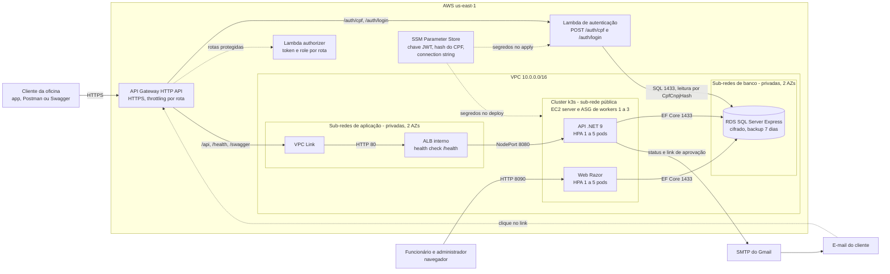
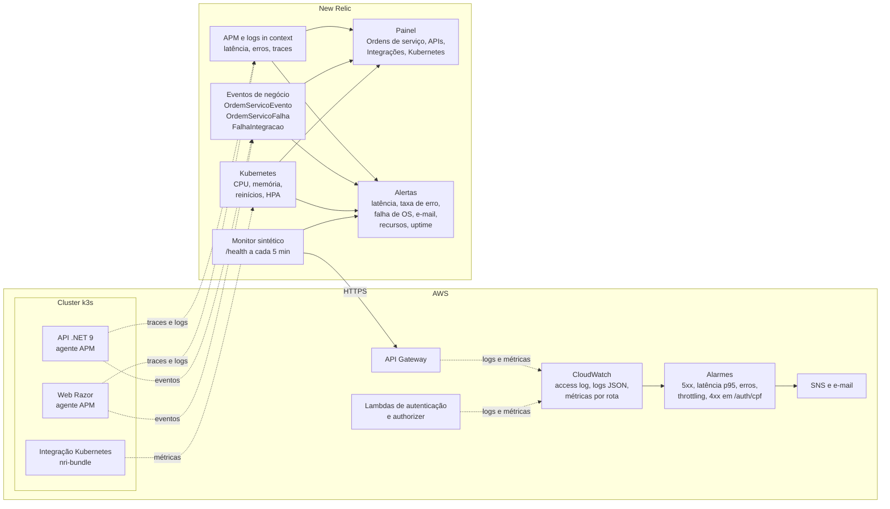
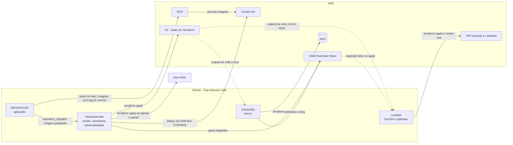

# Diagrama de componentes

Visão de nuvem, APIs, banco e monitoramento do MechanicLtda na Fase 3. Os diagramas usam
Mermaid e são renderizados pelo próprio GitHub.

## 1. Nuvem, APIs e banco

Os nós do cluster ficam na sub-rede pública porque precisam de saída para a internet (ECR e SSM)
e a VPC não tem NAT Gateway. Depois da virada para o gateway (`expose_nodeport_publicly = false`
no InfraKubernete), a porta 8080 da API passa a aceitar tráfego só do security group do ALB, e o
único caminho de fora até a API é o gateway. Até lá, a 8080 continua pública para não
interromper o ambiente durante a validação.

## 2. Monitoramento

O API Gateway e as Lambdas só aparecem no New Relic com a integração AWS da conta; até lá, esse
trecho é monitorado pelos alarmes do CloudWatch ([ADR-010](../adr/ADR-010-observabilidade-new-relic.md)).

## Componentes

| Componente | Responsabilidade | Repositório |
|---|---|---|
| API Gateway HTTP API | Ponto único de entrada da API: HTTPS, roteamento, autenticação na borda, throttling e access log | Lambda |
| Lambda de autenticação | Valida o CPF, consulta existência e status do cliente e emite o JWT; também autentica funcionários por e-mail e senha | Lambda |
| Lambda authorizer | Autentica o token e filtra role por rota antes de a requisição chegar ao cluster | Lambda |
| VPC Link e ALB interno | Levam o tráfego do gateway até os nós do cluster sem expô-los à internet | Lambda (VPC Link) e InfraKubernete (ALB) |
| Cluster k3s | Executa API e Web, com HPA nos pods e ASG nos nós | InfraKubernete |
| API .NET 9 | Regras de negócio da oficina, validação de JWT, roles e posse do recurso | MechanicLtda |
| Web Razor | Interface administrativa, com autenticação por cookie | MechanicLtda |
| RDS SQL Server | Dados de clientes, veículos, OS, estoque, orçamentos e usuários | InfraSGBD |
| SSM Parameter Store | Segredos compartilhados entre aplicação, cluster e Lambda | InfraKubernete e InfraSGBD |
| New Relic | APM, logs, integração Kubernetes, eventos de negócio, painel, alertas e monitor sintético | MechanicLtda e InfraKubernete |
| CloudWatch e SNS | Logs, métricas e alarmes do gateway e das Lambdas | Lambda |

## 3. Entrega: repositórios, pipelines e contratos

Os contratos entre os repositórios — ECR, `terraform_remote_state`, SSM e `repository_dispatch` —
e a ordem de subida estão na [ADR-008](../adr/ADR-008-quatro-repositorios.md). O que cada branch
dispara está na [ADR-009](../adr/ADR-009-sem-ambiente-de-homologacao.md).
