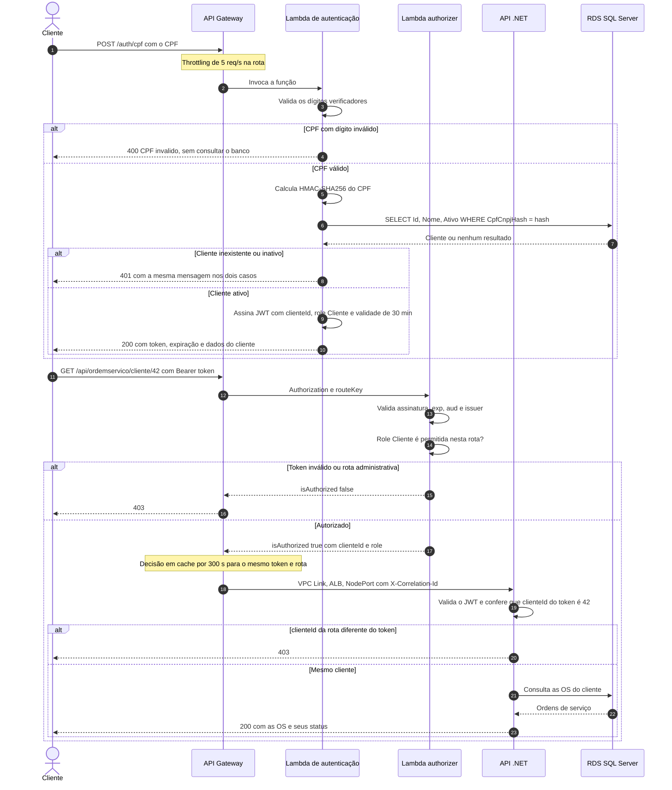
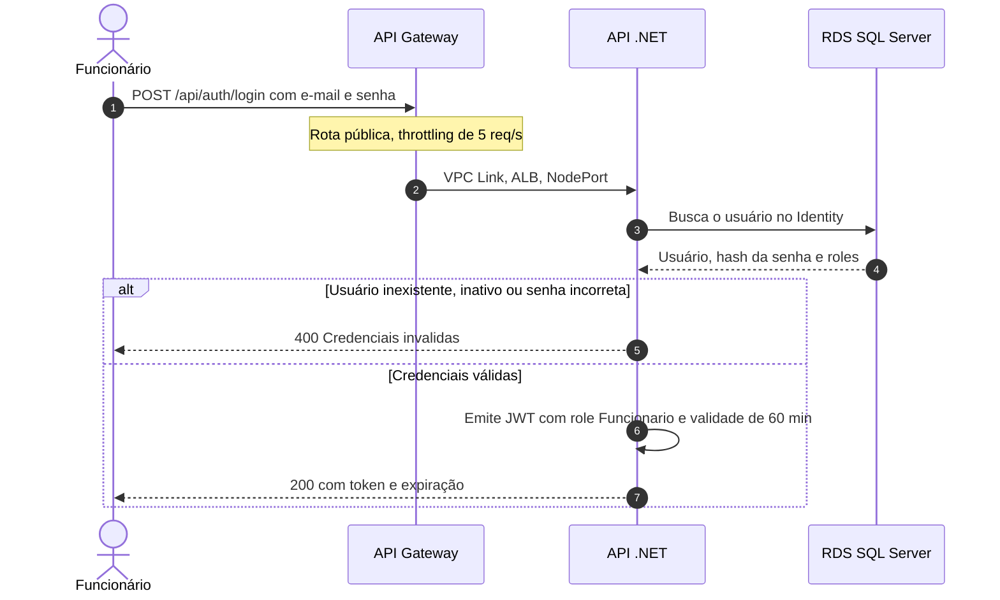
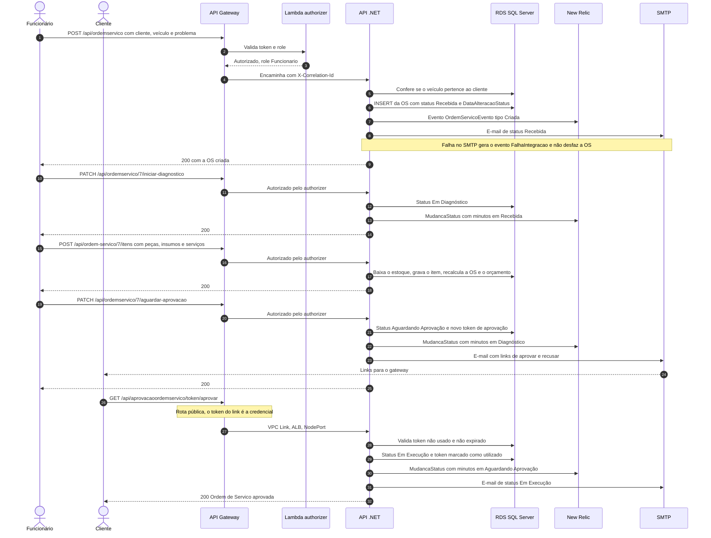

# Diagramas de sequência

Fluxos de autenticação e de abertura de ordens de serviço, como implementados na Fase 3.
As rotas estão em minúsculas porque o roteamento do API Gateway diferencia maiúsculas.

## 1. Autenticação do cliente por CPF e consulta das próprias ordens de serviço

## 2. Autenticação de funcionário por e-mail e senha

O mesmo login também está disponível pela Lambda em `POST /auth/login`, que lê as tabelas do
Identity e emite um token idêntico ao da API.

## 3. Abertura da ordem de serviço até a aprovação do orçamento

Depois da aprovação, o funcionário finaliza (`PATCH .../finalizar`) e entrega
(`PATCH .../entregar`) a OS. Cada transição registra o tempo no status anterior, o que alimenta o
painel "Tempo médio por status: Diagnóstico, Execução e Finalização".
