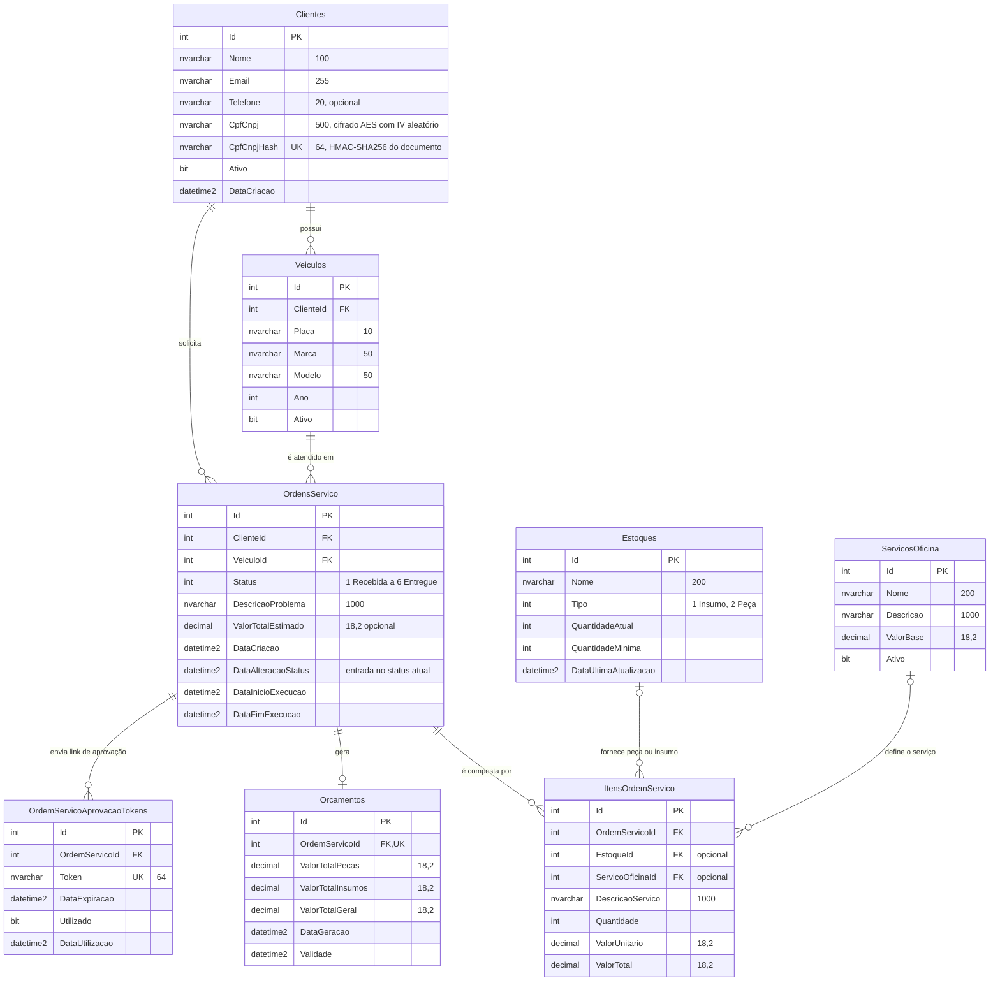
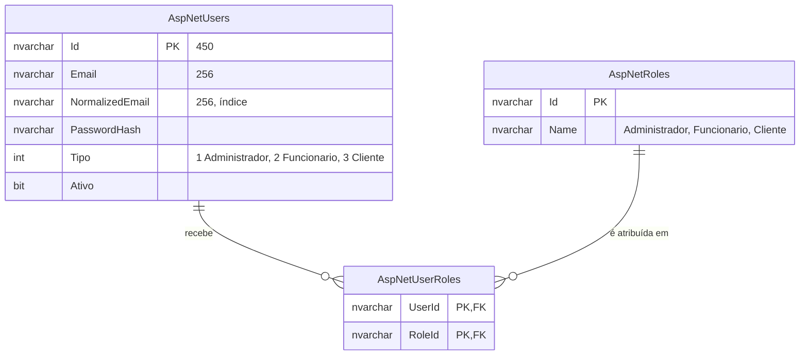

# Banco de dados: justificativa, modelo relacional e ajustes

| Campo | Valor |
|---|---|
| Documento | Justificativa formal da escolha do banco e ajustes no modelo relacional |
| Data | 2026-09-13 |
| Fonte do modelo | `src/MechanicLtda.Infrastructure/Migrations/BancoAPIContextModelSnapshot.cs` |
| Infraestrutura | Repositório [InfraSGBD](https://github.com/Fiap-Mecanic-Ltda/InfraSGBD) (`infra/rds.tf`) |
| Decisões relacionadas | [RFC-003](../rfc/RFC-003-escolha-do-banco-de-dados.md), [ADR-011](../adr/ADR-011-sql-server-gerenciado-rds.md), [ADR-003](../adr/ADR-003-indice-cego-cpf.md) |

## 1. Escolha do banco

**Decisão:** SQL Server gerenciado pelo **Amazon RDS** (edição Express, `db.t3.micro`, 20 GiB
`gp3`), em sub-redes privadas, acessível apenas pelos nós do cluster e pela Lambda de
autenticação.

### 1.1 Por que relacional

O domínio da oficina é transacional e fortemente relacionado. As regras que o sistema precisa
garantir são, na prática, restrições relacionais:

| Regra de negócio | Como o banco garante |
|---|---|
| Toda OS pertence a um cliente e a um veículo que existem | Chaves estrangeiras obrigatórias `OrdensServico.ClienteId` e `OrdensServico.VeiculoId` |
| Um cliente com OS não pode ser apagado e deixar a OS órfã | Exclusão restrita (`DeleteBehavior.Restrict`, `NO ACTION` no SQL Server) de `OrdensServico` para `Clientes` e `Veiculos` |
| Itens e orçamento não existem sem a OS | `ON DELETE CASCADE` de `ItensOrdemServico`, `Orcamentos` e `OrdemServicoAprovacaoTokens` |
| Uma OS tem no máximo um orçamento | Índice único em `Orcamentos.OrdemServicoId` |
| Um link de aprovação não pode ser reutilizado por outra OS | Índice único em `OrdemServicoAprovacaoTokens.Token` |
| Um CPF identifica um único cliente na autenticação | Índice único filtrado em `Clientes.CpfCnpjHash` |
| Valores monetários sem erro de arredondamento | `decimal(18,2)` em valores de itens, OS e orçamento |

Um banco de documentos ou chave-valor exigiria reimplementar essas garantias na aplicação — e,
principalmente, perderia a atomicidade entre agregados: adicionar um item à OS baixa o estoque,
recalcula o total da OS e atualiza o orçamento, que são três tabelas diferentes.

### 1.2 Por que SQL Server

1. **Continuidade.** O banco é SQL Server desde a primeira migration (`InitialCreate`,
   abril de 2026). Trocar de motor agora exigiria refazer as 11 migrations e reescrever
   trechos específicos do dialeto, como o filtro de índice `[CpfCnpjHash] IS NOT NULL`.
2. **Integração com a stack.** A aplicação é .NET 9 com EF Core e ASP.NET Core Identity. O
   provedor SQL Server é o de primeira linha do EF Core, e as tabelas do Identity
   (`AspNetUsers`, `AspNetRoles`, `AspNetUserRoles`) vivem no mesmo banco, com os mesmos
   backups.
3. **Mesmo motor em todos os ambientes.** Desenvolvimento local usa o container
   `mcr.microsoft.com/mssql/server` (docker-compose e overlay `local` do Kubernetes), e os
   testes de integração usam o provedor InMemory. O dialeto é o mesmo do RDS — com uma
   ressalva de versão: o container local é SQL Server 2022 e o RDS roda 2019
   (`15.00.4430.1.v1`). Ver o ajuste recomendado 9.

### 1.3 Por que gerenciado (RDS)

O desafio exige banco gerenciado. Concretamente, o RDS entrega o que o time teria de operar à
mão numa instância própria:

| Necessidade | Configuração no RDS |
|---|---|
| Backup e restauração | Backup automático com retenção de 7 dias (`backup_retention_period`) |
| Dados sensíveis em repouso | `storage_encrypted = true` (chave `aws/rds`), além da criptografia de CPF/CNPJ na aplicação |
| Correções de segurança | `auto_minor_version_upgrade = true` |
| Isolamento de rede | `publicly_accessible = false`, sub-redes sem rota para a internet, porta 1433 aberta só para os security groups dos nós e da Lambda |
| Credenciais fora do código | Connection string publicada no SSM Parameter Store como `SecureString` |

### 1.4 Trade-offs aceitos

| Limitação | Impacto neste projeto | Quando revisitar |
|---|---|---|
| Edição **Express**: banco de até 10 GB e sem Multi-AZ | O volume de uma rede de oficinas está muito abaixo de 10 GB; indisponibilidade de uma AZ derruba o banco | Crescimento de dados ou exigência de SLA; a troca para Standard com Multi-AZ é mudança de `engine` e `multi_az` no Terraform |
| Licença embutida no preço por hora | SQL Server custa mais por hora que PostgreSQL na mesma classe | Se o custo virar restrição, avaliar migração para PostgreSQL (ver RFC-003) |
| Sem `deletion_protection` e sem snapshot final | Um `destroy` apaga os dados | Antes de ter dados reais de clientes |

## 2. Modelo entidade-relacionamento

O diagrama reflete o modelo aplicado pelas migrations até `AddDataAlteracaoStatusOrdemServico`.
Colunas de auditoria foram omitidas para legibilidade.

### 2.1 Domínio da oficina

### 2.2 Usuários do sistema (ASP.NET Core Identity)

Tabelas de quem opera o sistema. Não há chave estrangeira entre elas e o domínio da oficina: um
usuário não é um cliente (ver seção 3.1). As tabelas auxiliares do Identity (claims, logins e
tokens) foram omitidas.

## 3. Relacionamentos

| Relacionamento | Cardinalidade | Exclusão | Por quê |
|---|---|---|---|
| `Clientes` → `Veiculos` | 1 : N | Restrict | Um cliente pode ter vários veículos. Apagar o cliente não pode apagar veículos com histórico de atendimento. |
| `Clientes` → `OrdensServico` | 1 : N | Restrict | A OS é o registro fiscal e operacional do atendimento: não pode sumir junto com o cadastro. |
| `Veiculos` → `OrdensServico` | 1 : N | Restrict | Mesmo motivo: o histórico de manutenção do veículo precisa sobreviver. |
| `OrdensServico` → `ItensOrdemServico` | 1 : N | Cascade | Um item só existe dentro da sua OS. |
| `Estoques` → `ItensOrdemServico` | 0..1 : N | Set null | O item pode consumir uma peça ou um insumo do estoque. Se o cadastro de estoque for removido, o item continua com quantidade e valores. |
| `ServicosOficina` → `ItensOrdemServico` | 0..1 : N | Set null | O item pode ser um serviço do catálogo (mão de obra), que fornece descrição e valor base. Mesmo motivo do `SetNull`. |
| `OrdensServico` → `Orcamentos` | 1 : 0..1 | Cascade | O orçamento é derivado dos itens da OS e recalculado a cada alteração; a unicidade é garantida por índice. |
| `OrdensServico` → `OrdemServicoAprovacaoTokens` | 1 : N | Cascade | Cada envio para aprovação gera um token novo. Tokens anteriores continuam válidos até expirar ou ser usados, mas a aprovação só é aceita com a OS em "Aguardando Aprovação". |
| `AspNetUsers` ↔ `AspNetRoles` | N : N | Cascade | Tabela de junção do Identity: um usuário com uma ou mais roles. |

### 3.1 Pontos de atenção no modelo

- **`OrdensServico` guarda `ClienteId` e `VeiculoId`, e o veículo já pertence a um cliente.**
  É uma redundância intencional: a consulta de progresso por cliente
  (`GET /api/ordemservico/cliente/{clienteId}`) é a rota mais usada pelo cliente autenticado
  por CPF e dispensa o join com `Veiculos`. A consistência entre as duas chaves é garantida no
  domínio (`OrdemServicoService` recusa veículo de outro cliente), não por constraint.
- **Um item referencia estoque ou serviço, e as duas chaves são opcionais.** Nada no banco
  impede um item com as duas nulas ou as duas preenchidas; hoje isso é regra da aplicação.
- **Usuários e clientes não se relacionam.** `AspNetUsers` (quem opera o sistema) e `Clientes`
  (quem é atendido) são cadastros independentes. É por isso que o cliente se autentica por CPF
  contra `Clientes`, e não por e-mail e senha contra `AspNetUsers` — ver
  [RFC-004](../rfc/RFC-004-estrategia-de-autenticacao.md).

## 4. Ajustes no modelo relacional

### 4.1 Evolução do modelo (migrations)

| Migration | Ajuste | Motivação |
|---|---|---|
| `20260423_InitialCreate` | Identity, `Clientes`, `Veiculos` | Base da Fase 1 |
| `20260423_AddOrdemServico` | `OrdensServico` com FKs obrigatórias e índices em `ClienteId` e `VeiculoId` | Núcleo do domínio; índices nas FKs para as consultas por cliente e veículo |
| `20260423_AddItemOrdemServico` | `ItensOrdemServico` com índice em `OrdemServicoId` | Itens de peças, insumos e serviços |
| `20260423_AddEstoque` | `Estoques` e FK opcional a partir dos itens | Controle de peças e insumos |
| `20260424_AddOrcamento` | `Orcamentos` 1:1 com índice único | Orçamento consolidado da OS (valores de peças, insumos e total), base do PDF enviado ao cliente |
| `20260425_AddCpfCnpjToCliente` | `Clientes.CpfCnpj` (14) | Identificação fiscal do cliente |
| `20260506_EncryptCpfCnpjCliente` | `CpfCnpj` ampliado para 500 caracteres | O valor passou a ser gravado cifrado (AES + IV em Base64), maior que o documento em texto |
| `20260711_AddServicoOficinaTempoExecucao` | `ServicosOficina`, FK opcional dos itens, `DataInicioExecucao` e `DataFimExecucao` na OS | Catálogo de serviços e tempo médio de execução |
| `20260711_AddOrdemServicoAprovacaoToken` | Tokens de aprovação com índice único no token | Aprovação ou recusa do orçamento por link de e-mail |
| **`20260912_AddCpfCnpjHashCliente`** | **`CpfCnpjHash` (64) com índice único filtrado** | **Fase 3.** O CPF cifrado com IV aleatório não é pesquisável por igualdade; o índice cego permite à Lambda localizar o cliente pelo CPF sem conhecer a chave de criptografia, e o índice único impede dois clientes com o mesmo documento. O filtro `IS NOT NULL` permite linhas antigas sem hash até o backfill no startup. Ver [ADR-003](../adr/ADR-003-indice-cego-cpf.md). |
| **`20260913_AddDataAlteracaoStatusOrdemServico`** | **`DataAlteracaoStatus` na OS** | **Fase 3.** Medir o tempo de cada etapa (Diagnóstico, Execução, Finalização) exigido no painel de monitoramento; antes só existia o intervalo de execução. |

Junto com a última migration, foi corrigida uma perda de dados na atualização de OS: o DTO de
atualização não trazia `DataInicioExecucao` e `DataFimExecucao`, e o `Update` do EF Core grava
todas as colunas, então editar uma OS em execução apagava as duas datas. O serviço passou a
preservá-las.

### 4.2 Ajustes recomendados (não aplicados)

Levantados na revisão do modelo para esta documentação. Nenhum bloqueia a Fase 3; estão em
ordem de impacto.

| # | Ajuste | Problema que resolve | Esforço |
|---|---|---|---|
| 1 | Transação explícita ao adicionar ou alterar item de OS | `ItemOrdemServicoService.AdicionarAsync` baixa o estoque, grava o item, recalcula a OS e atualiza o orçamento em chamadas `SaveChanges` separadas. Uma falha no meio deixa o estoque baixado sem o item correspondente. | Baixo: `BeginTransactionAsync` no serviço |
| 2 | `EnableRetryOnFailure` no `UseSqlServer` | Falhas transitórias do RDS (failover, manutenção) viram erro 500 imediato. Exige usar a *execution strategy* junto com o item 1. | Baixo |
| 3 | Índice único em `Veiculos.Placa` e em `Clientes.Email` | A unicidade é verificada só no domínio (`PlacaExisteAsync`, `EmailExisteAsync`): duas requisições simultâneas passam na verificação e gravam duplicado. | Baixo: migration com índice único, após limpar duplicados |
| 4 | `CHECK` em `ItensOrdemServico` | Garantir que o item referencia estoque **ou** serviço, e que `Quantidade > 0`. | Baixo |
| 5 | `CHECK (QuantidadeAtual >= 0)` em `Estoques` | O domínio verifica o saldo antes de baixar, mas lê, compara e grava em passos separados, sem controle de concorrência: duas baixas simultâneas passam na verificação e deixam o saldo negativo. | Baixo |
| 6 | Levar filtro e ordenação da listagem para a consulta, com índice em `OrdensServico(Status, DataCriacao)` | `ObterTodosAsync` carrega todas as OS com cliente e veículo e só então descarta as finalizadas e ordena em memória. Com volume, cresce em tempo e em memória a cada chamada. | Baixo |
| 7 | Padronizar datas em UTC | `DataCriacao` é gravada com `DateTime.Now` e as demais datas com `DateTime.UtcNow`. Em host fora de UTC, tempos calculados entre as duas ficam deslocados. | Médio: exige migração dos dados existentes |
| 8 | Login SQL somente leitura para a Lambda | A Lambda de autenticação usa a connection string do usuário master, com permissão de escrita em todo o banco, quando só precisa ler `Clientes` e as tabelas do Identity. | Baixo |
| 9 | Alinhar a versão do SQL Server local e do RDS | O container local é SQL Server 2022 e o RDS é 2019. Um recurso disponível só em 2022 passaria nos testes locais e falharia em produção. | Baixo: fixar a imagem `2019-latest` ou subir o RDS para `16.00` |
